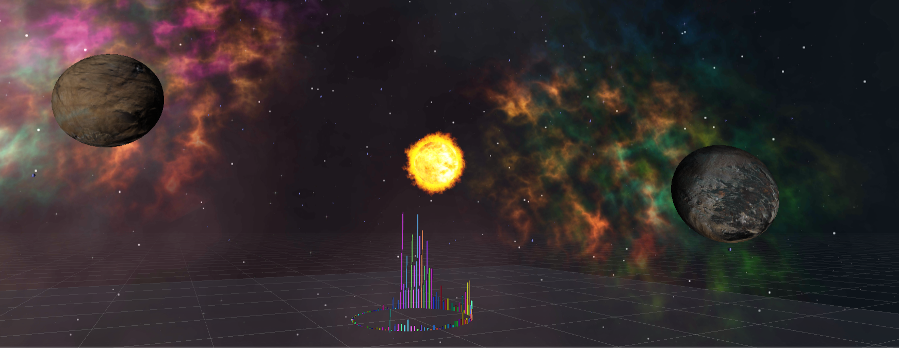
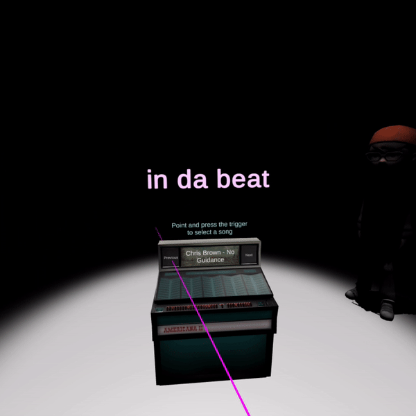

### INFO 5340 / CS 5650
### Virtual and Augmented Reality 
# Group project - In Da Beat - Fall 2019

### Group Members:
- [Katie Donahoe, kd459@cornell.edu, kdonahoe]
- [Nathan Cinnamond, nc532@cornell.edu, njcinnamond]
- [Phil Asmar, pye4@cornell.edu, philasmar]

### Project Description:
In Da Beat is a Virtual Reality project (deployed to Oculus Quest) aimed at bringing the complete karaoke experience to users in a full variety of settings, wherever they may be. Players take the stage in a host of different environments to sing along to a wide selection of songs while viewing an audio visualization. The project incorporates a networking feature that connects multiple headsets to the same performance stage.

### The Experience:
Zoom-out view of the main performance scene. When user(s) enter this scene, they are placed in the center of the audio visualization (which is the multicolored circle)

**Jukebox : Select a song**

At the start of the game, single or multiple users can enter the same jukebox room, where they collectively select a song to perform. This is achieved via aiming at the song and pressing the index trigger of the controller. There is a spotlight above the jukebox and background chatter of an audience can be heard, which gives the impression of a performance venue. Once the user selects the preferred song, they are all moved to the same performance scene where their track begins to play.

**Performance Area: Sing a song, surrounded by visualizations**
The main scene is the performance area, where users plays in a match zone which is surrounded by a circular audio visualization. The audio visualization represents the spectrum data of the song chosen as sampled continuously by a Fast Fourier Transform. Lyrics of the selected song are displayed in the world space such that it maintains alignment with the VR camera. Users can further control the scene by being able to stop, play, fast forward, and rewind the song. In addition, the user can customize the environment and corresponding audio visualizations through the vertical color control panel, providing a harmonized and immersive experience (some of these scenes are depicted to the left). These actions affect all users in the same scene.

**[Check out the video](https://drive.google.com/file/d/1S3_tEi53Kg-UI-6Hu0NEoKyvvc1i0VB8/view)**

Build by running the apk located in the build folder!
